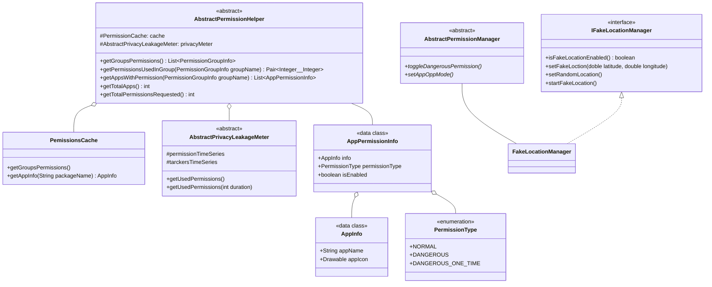
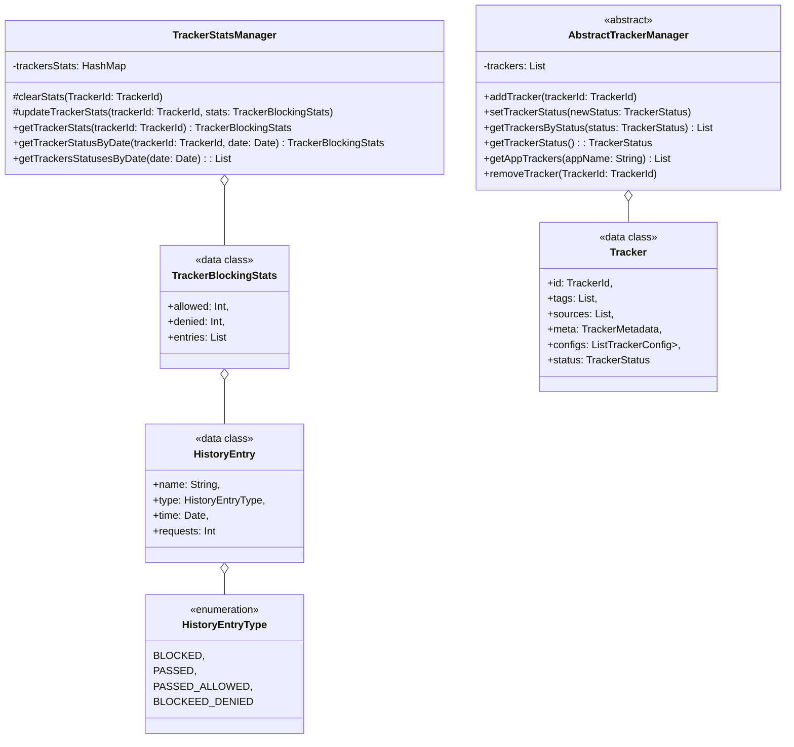

# Privacy Modules API

Root module for the privacy tools.
This module defines all the low level APIs to monitor and manage privacy in android systems. It uses interface and abstract classes, and then should come with other modules, implementing these interfaces.
The implementations could use various technical solutions depending on the privileges levels they have in the android system.

# Modules architecture

See [here](./doc/architecture.md)

# Functionalities 

## v0.0.2

* Permissions
    * List apps
    * List app's permissions
    * List status of runtime permission
    * Set status of runtime permissions
    * List mode of appOp permissions
    * Set mode of appOp permissions

* Fake location
    * Fake the location of the device, at the specified point.

# Structure (UML class diagrams)

History:

* v0.0.2.4 (Trackers blocker)
* v0.0.2.2 (Permissions, FakeLocation)

