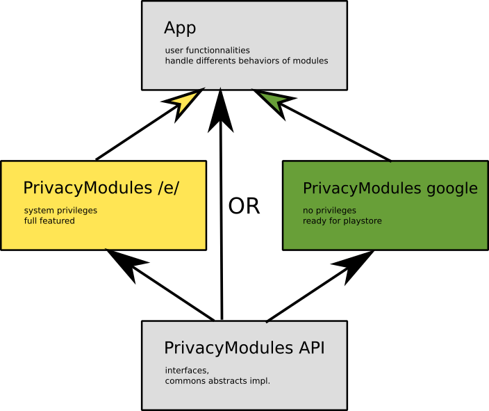

# Architecture of Privacy Modules

_updated October 14, 2020_

Privacy Modules gives ready to use API to observe and manage privacy related behaviour in Android. It can be bundled for regular android applications (to publish on stores, later called _google_), or as a system applications (later called _e_.
Actual functionalities are related to:

* applications permissions
* fake location

# General architecture

## One API library, many implementations library

The *API library* holds the interfaces that define the API of Privacy Modules. It also holds abstract implementations of these interfaces, to factor all the code that do not depends on privileges level (which means it is common to all the implementations modules).

The implementations modules fills the remaining functionalities, depending on their privileges in the system. Both _google_ and _e_ versions will implement the same interface, but for some method, the _google_ version may ask the user to to the work, when the _e_ version just do it. 
The choice of the module to embed is done at compile time through gradle build flavors.

## Why separate the implementations modules

The _e_ and _gogole_ implementations are totally different and has opposed constraints:

* _e_  version access to hidden API and so requires specific building environment.
* _google_ version should land in the PlayStore, which perform automatic code inspections before publications and are sensitive about the use of hidden API. 

It's safer to not bundle restricted calls and build on a standard environment to submit the app to the PlayStore. The use of separate modules allow that.

